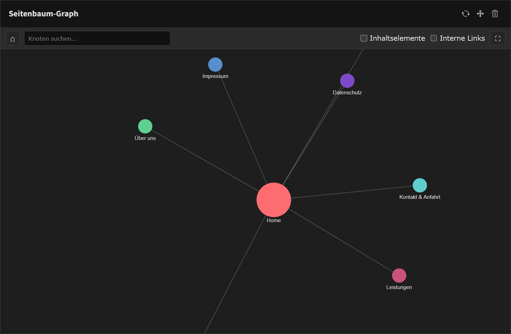

# TYPO3 Extension: page_graph

[](https://get.typo3.org/version/12)
[](https://get.typo3.org/version/13)
[](https://get.typo3.org/version/14)
[](https://github.com/rtfirst/page-graph/actions/workflows/ci.yaml)
[](https://packagist.org/packages/rtfirst/page-graph)
[](https://packagist.org/packages/rtfirst/page-graph)
[](https://github.com/rtfirst/page-graph/blob/main/LICENSE)

A TYPO3 dashboard widget that visualizes the page tree and content elements as an interactive force-directed graph.



## Features

- Interactive force-directed graph of the TYPO3 page tree
- Content element nodes with toggle visibility
- Internal links view (typolinks + navigation structure)
- Hover highlighting with connected node emphasis
- Click nodes to view details and edit records in the TYPO3 backend
- Real-time search filtering
- Fullscreen mode
- Light and dark mode support (TYPO3 12/13/14)
- Depth-based branch coloring
- German and English translations

## Installation

### Composer

```bash
composer require rtfirst/page-graph
```

Then activate the extension:

```bash
vendor/bin/typo3 extension:setup
vendor/bin/typo3 cache:flush
```

## Usage

1. Go to the TYPO3 backend Dashboard module
2. Click "Add widget"
3. Select "Page Graph" from the content group
4. The widget displays your page tree as an interactive graph

### Interactions

- **Hover** over a node to highlight it and its connections
- **Click** a node to open the info panel with details and an edit link
- **Search** to filter and highlight matching nodes
- **Toggle** "Content Elements" to show/hide content element nodes
- **Toggle** "Internal Links" to visualize typolinks and navigation links
- **Fullscreen** for a larger view
- **Scroll** to zoom, **drag** to pan

## Requirements

- TYPO3 12.4 - 14.x
- PHP 8.1 - 8.4
- TYPO3 Dashboard extension

## License

GPL-2.0-or-later
